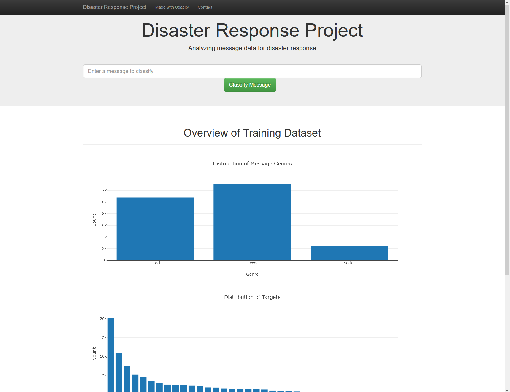

# Disaster Response Pipeline Project

This repo contains my Udacity project on a disaster response pipeline. The idea in this project is to develop a end-to-end pipeline that consists of an ETL-pipeline that feeds a machine learning model. The model and the data visualizations is then served in a Flask web app.

### Files

In the `data` folder, you can find the data used for my project. Furthermore, you can find the module to process this data which is named `process_data.py` that contains my ETL-pipeline to transform the data and save it to a SQLite-database which is also saved in this folder.

In the `models` folder, you can find my classification pipeline that used the transformed data from the step above to train a text classifier. The text-classification-pipeline is described in `train_classifier.py`. After training, the model is serialized into this folder.

In the `app` folder, I placed the web app, that used the data and text classifier to allow an interactive use of the text classifier and to display some data statistics in a interactive way.

### Installation

To run this app, you need to install the libraries listed in `env.yml`. If you have Anaconda/Miniconda, just run `conda env create -f env.yml` to install all necessary libraries. After successfully installing the libraries, you need to activate the environment with `conda activate disaster`to be able to run the pipeline.

### Instructions:

1. Run the following commands in the project's root directory to set up your database and model.

   - To run ETL pipeline that cleans data and stores in database
     `python data/process_data.py data/disaster_messages.csv data/disaster_categories.csv data/DisasterResponse.db`
   - To run ML pipeline that trains classifier and saves the model (NOTE: This takes some minutes.)
     `python models/train_classifier.py data/DisasterResponse.db models/classifier.pkl`

2. Run the following command in the app's directory to run your web app.
   `python run.py`

3. Go to http://0.0.0.0:3001/ to see the web app.

### Results

The final app looks like this:

Furthermore, the text classifier shows mixed results. Some categories are learned very well with F1 score beyond 0.8. But there are many categories for which the classifier does not learn anything. The average F1 score over all categories is 0.19 which is not very satisfying. Thus, it would be an important next step to improve the classifier. Running the pipeline results in a results.csv which you can inspect yourself for the results.

### Acknowledgment

I thank Udacity for providing the data, the template, and supervision during this project.
